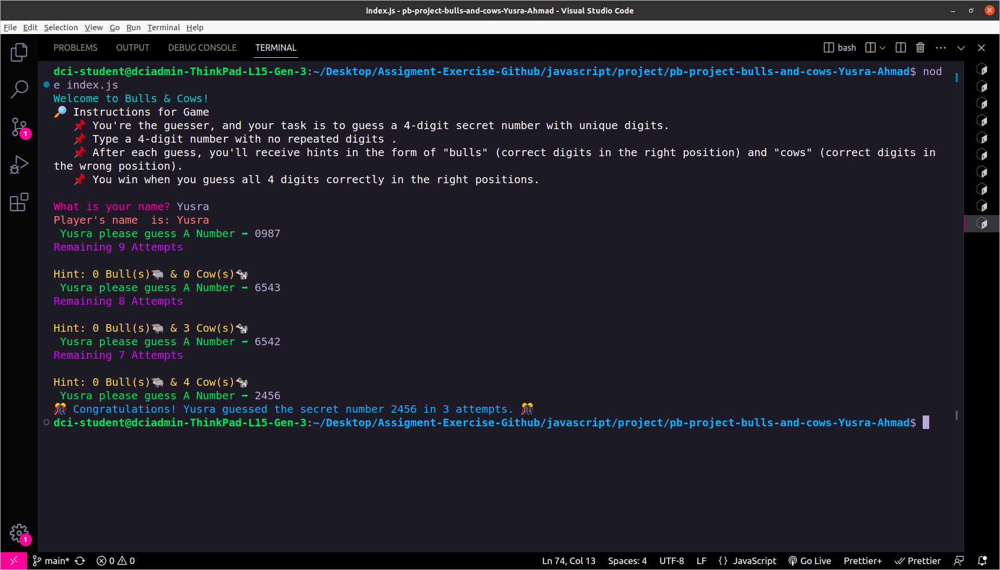

# Bulls and Cows Game 🐂🐄



## 🖱️Built With 🌠
>1️⃣ Javascript

>2️⃣ npm

> 3️⃣ Node.js

>4️⃣ GitHub


## Table of Contents
- [Introduction](#introduction)
- [Features](#features)
- [Prerequisites](#prerequisites)
- [Getting Started](#getting-started)
- [Game Rules](#game-rules)

## Introduction

Welcome to the Bulls and Cows Game 🐂🐄, a classic code-breaking game implemented in JavaScript. This project provides an interactive way to test your logic and deduction skills as you attempt to guess a secret number.

## Features ✨

- A randomly generated secret code for each game.
- Customizable code length and difficulty levels.
- Interactive command-line interface.
- Keep track of your progress with the number of attempts.
- Fun and challenging gameplay.

## Prerequisites 📋

Before you get started, ensure that you have the following prerequisites:

- [Node.js](https://nodejs.org/) installed on your machine.

## Getting Started 🚀

1. Clone this repository to your local machine:

   ```bash
   git clone https://github.com/your-username/bulls-and-cows-game.git
Navigate to the project directory:

bash
Copy code
cd bulls-and-cows-game
Install the required dependencies:

bash
Copy code
npm install
Start the game:

bash
Copy code
npm start


## Game Rules 🎯
Bulls and Cows is a two-player game, but this implementation is single-player with the computer generating the secret code. Here's how the game works:

➡️ The computer generates a secret code, and the player's task is to guess it.

➡️ The code consists of a sequence of digits (e.g., 4 digits).

➡️ The player makes a guess by entering a sequence of digits.

➡️ After each guess, the game provides feedback in the form of "Bulls" 🐂 and "Cows" 🐄.

➡️ A "Bull" means a correct digit in the correct position.

➡️ A "Cow" means a correct digit in the wrong position.

➡️ The player continues guessing until they correctly identify the entire secret code or reach the maximum number of attempts.

➡️ Continue guessing until you correctly identify the secret code or reach the maximum number of attempts.

➡️ Enjoy the challenge and have fun! 😄

